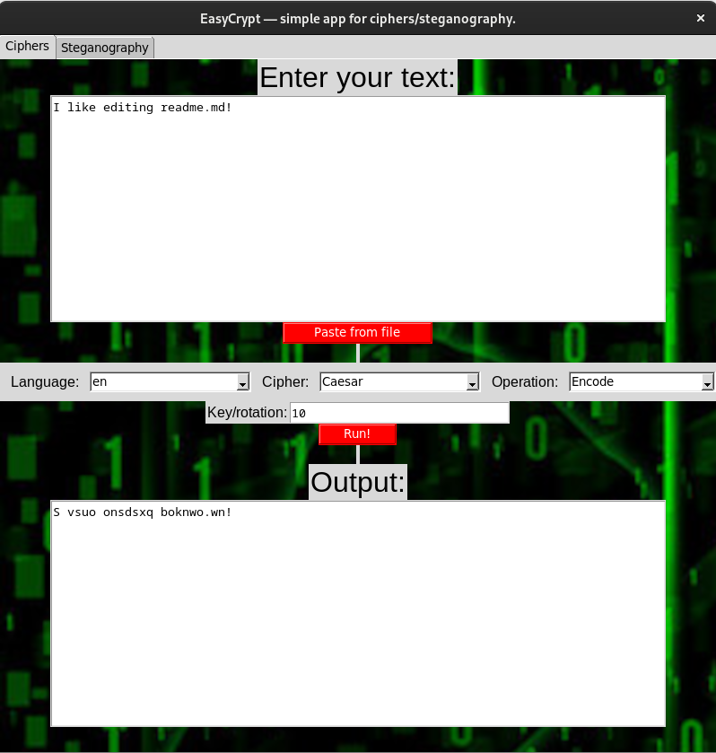
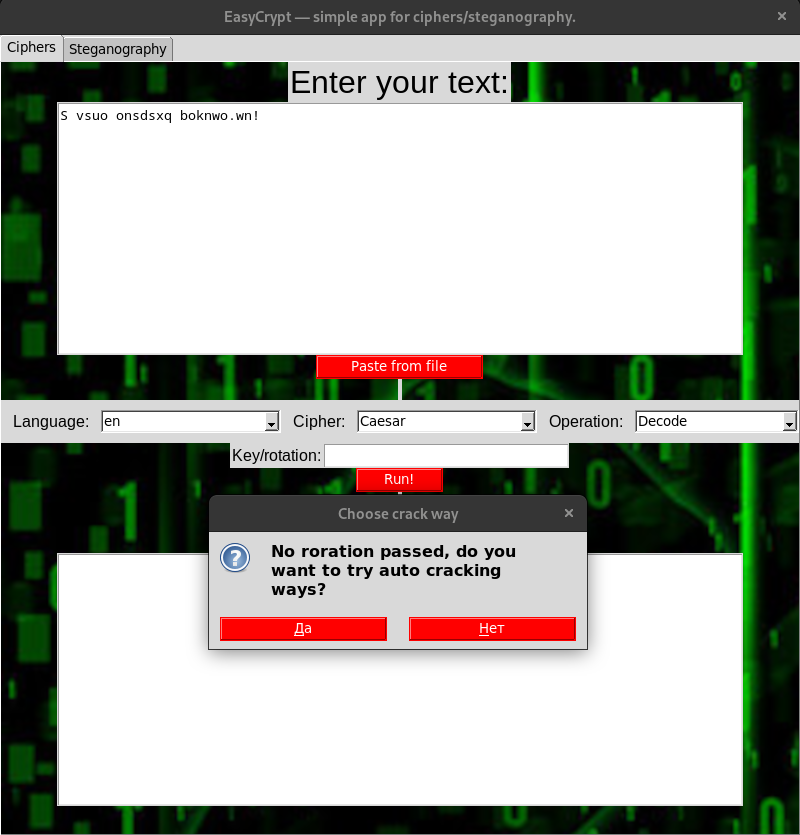
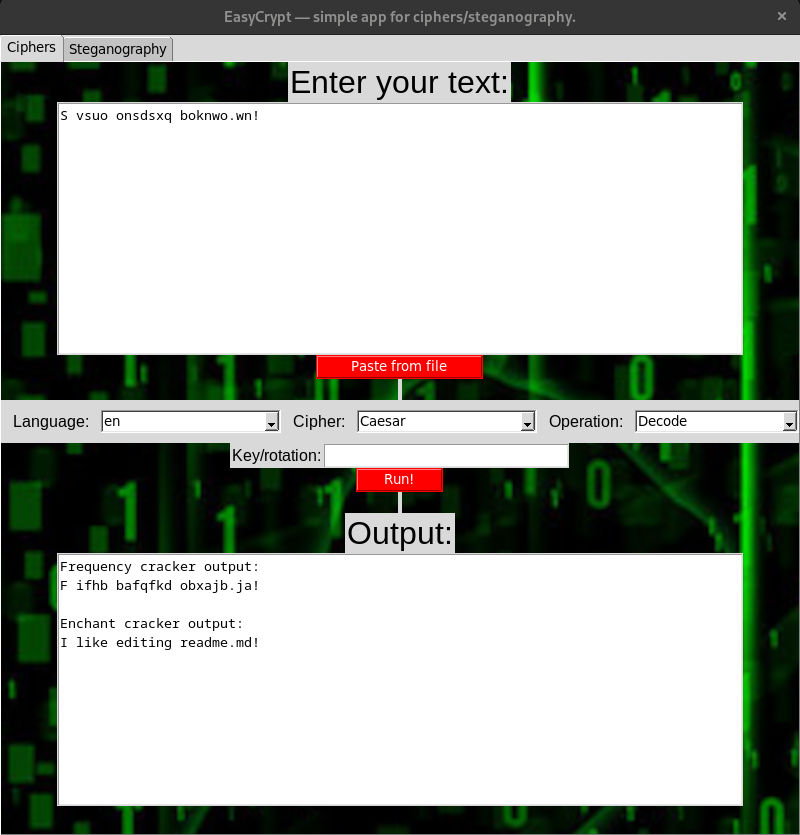
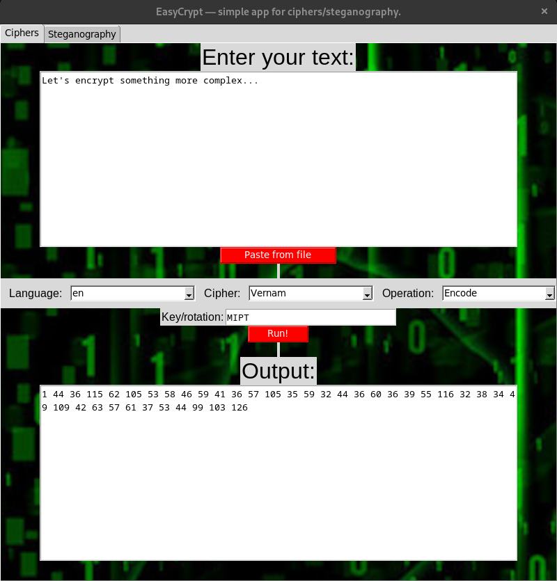
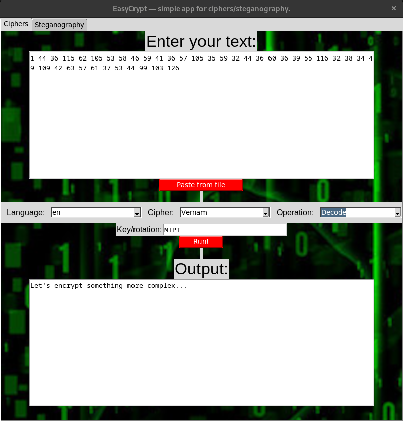
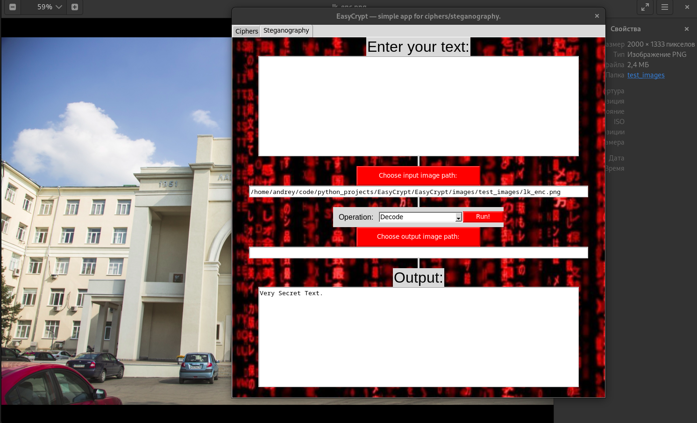

# EasyCrypt

Проект предлагает шифрование при помощи шифров Цезаря, Виженера и Вернама, их взлом, а также реализует стеганографию в картинках.

Функционал:

- Шифрование и дешифрование файлов шифрами Цезаря, Виженера и Вернама.
- Автоматический взлом шифра Цезаря методами частотного анализа, а также при помощи пакета ```enchant``` (морфологический анализатор адекватности текста).
- Стеганография: внедрение и извлечение текста в/из картинки формата bmp/png/jpg/etc, используя по 2 бита каждого пикселя.
- Графический интерфейс.
- Скрипт для работы из консоли.

Проект покрыт базовыми тестами, все функции задокументированы.

Установка:

```
git clone git@github.com:notdenied/EasyCrypt.git
cd EasyCrypt
pip install -r requirements.txt
```

Далее предполагается, что вы находитесь в корне проекта.

- Запуск графического приложения: ```python3 app.py```
- Запуск консольного скрипта: ```python3 console.py --help```
Например: ```python3 console.py --mode=cipher --text="36 73 28 29 6 12 80 36 20 29 24 27 3 90 94" --lang=en --op=Decode --cipher=Vernam --key=mipt```

```python3 console.py --mode=steganography --op=Decode --input_path=images/test_images/lk_enc.png```

Иерархия проекта такова:

- ```images``` - изображения для тестов и фона приложения.
- ```test_project.py``` - Unit-тесты внутренностей проекта.
- ```app.py``` - графическое приложение.
- ```ciphers.py``` - реализация шифров.
- ```steganography.py``` - реализация стеганографии.
- ```constants.py``` - константы проекта (словари и языки, размер окна клиента и так далее).
- ```requirements.txt``` - зависимости проекта.
- ```console.py``` - консольный клиент.

Ниже представлены несколько скриншотов работы графической части проекта.








